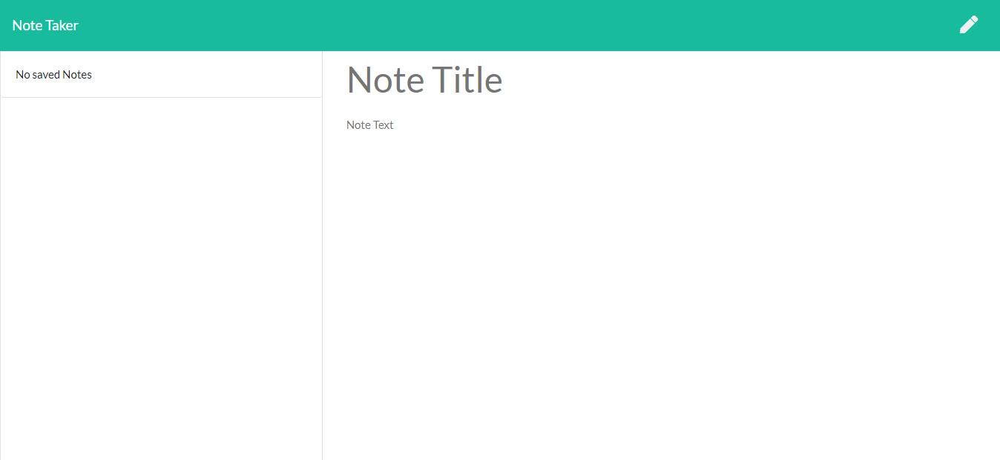
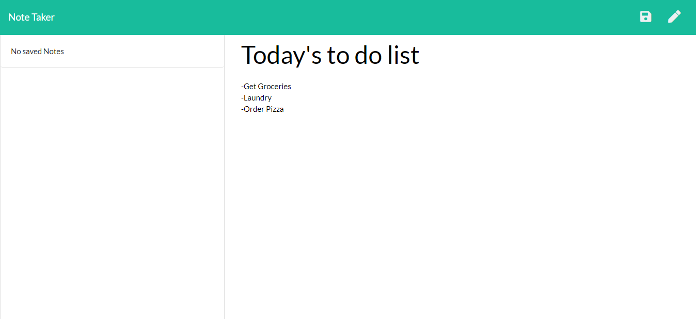
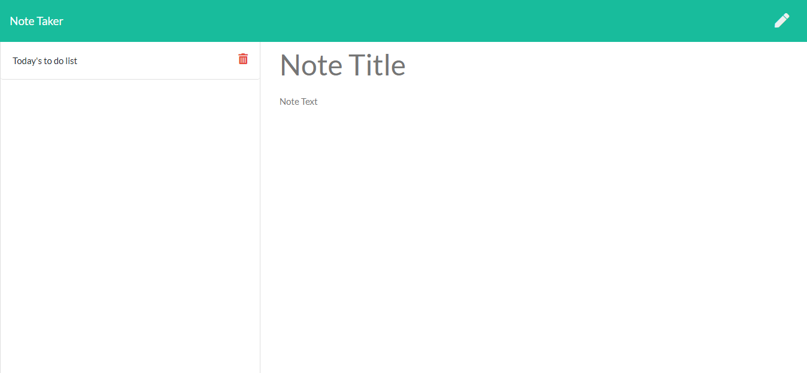

# Note Taker
### Created by Jordan Sarvay

## Description
Using Express, a server is set up to receive and post notes that the user writes in order to create a dynamically updating page that keeps track of notes they create.

[Deployed Link](https://sarvay-note-taker.herokuapp.com/)

## Table of Contents
* [Installation](#installation)
* [Usage](#usage)
* [Contributing](#contributing)
* [Testing](#testing)
* [Questions](#questions)
    
## Installation

This app is run through heroku so no installation is required on the user's end.
    
## Usage

Simply visit the deployed page and you will be able to write and delete notes.
    
## Contributing

If you are interested in contributing to this project, reach out to the creator to have a working branch established to upload to. All branches will be merged by the content creator to ensure a consistent app experience before being uploaded to the deployed version at heroku.

## Testing

No test files were created for this app, though in future deployment they will be created and run through JEST.
    
## Questions

Please feel free to reach out to either of the following links with questions regarding the use of this application.

##### Github: [JSarvay](http://github.com/JSarvay/)
##### E-mail: jordans1@vt.edu

